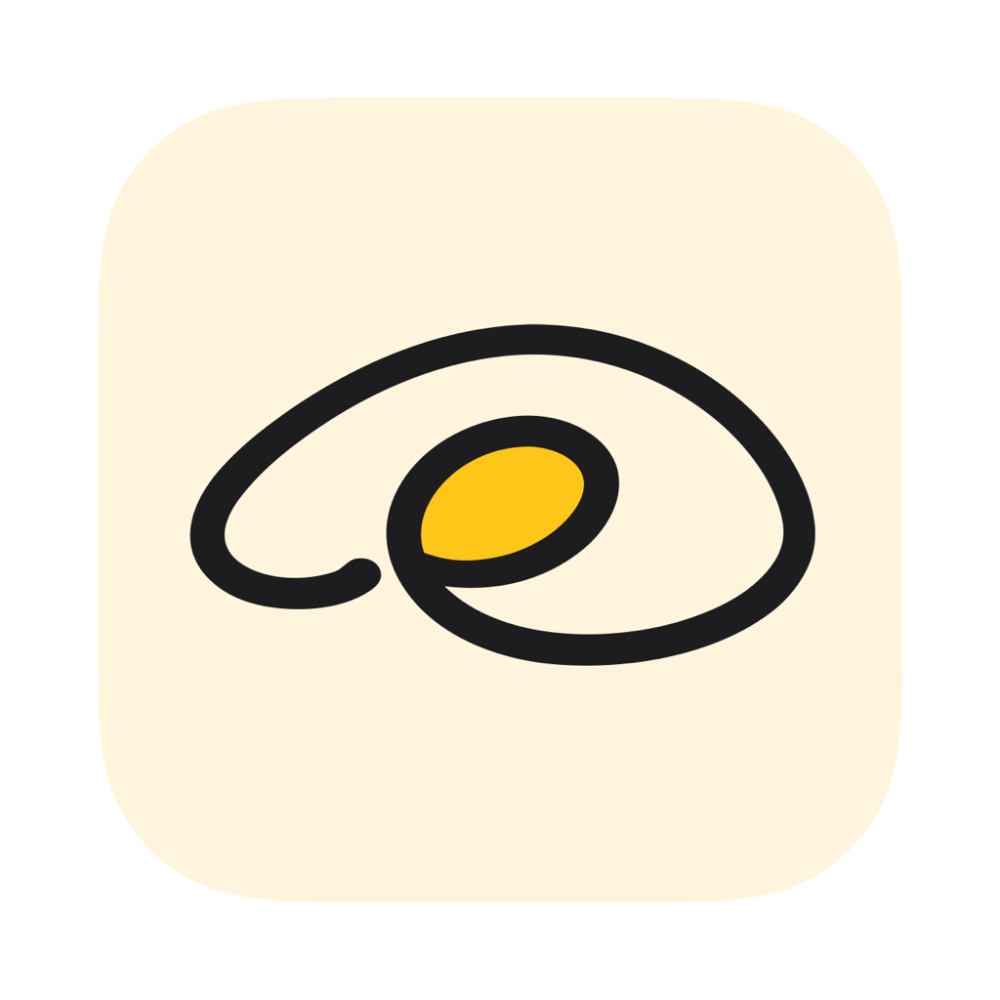
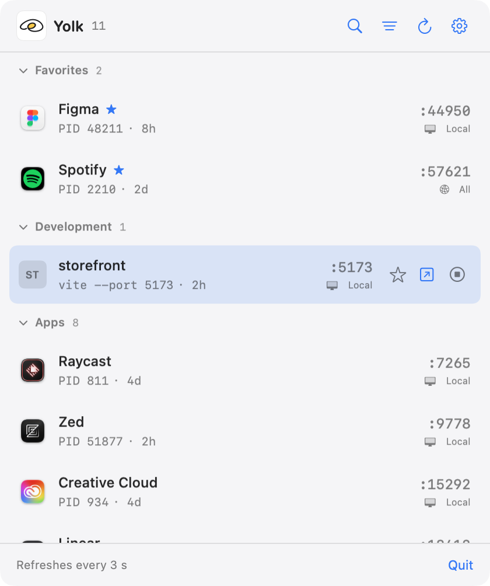
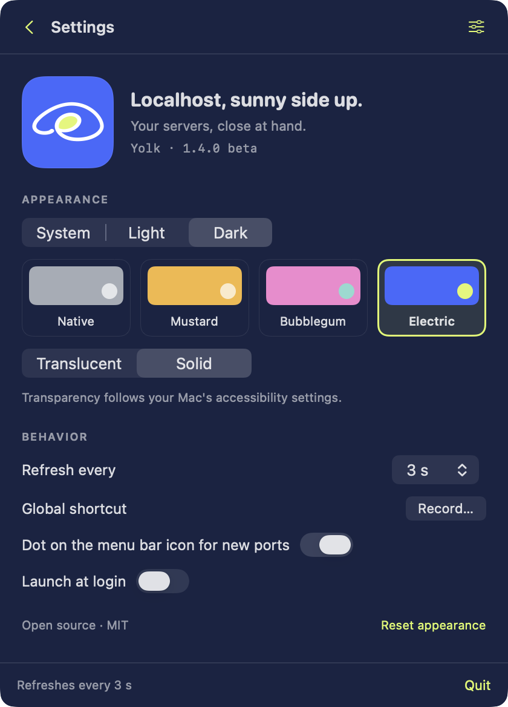

<p align="center">
  
</p>
<h1 align="center">Yolk</h1>
<p align="center">Localhost, sunny side up.<br>A tiny native macOS menu bar app for your local servers.</p>
<p align="center"><a href="docs/README.es.md">Español</a> · <a href="CONTRIBUTING.md">Contributing</a> · <a href="LICENSE">MIT license</a></p>

Find what's listening on localhost, open it in your browser, or stop it. No main window, no Dock icon, no account, no external packages.

**1.4 beta** · macOS 13+ · Swift + SwiftUI · Apple Silicon and Intel universal build



## Features

- TCP listeners grouped into Development, Databases, Apps, System and Other.
- Project names, application icons, local favicons and initials as a fallback.
- Each row shows the shortened command line and how long the process has been running.
- Docker, OrbStack, Colima and Rancher Desktop containers appear by container name and image; stopping one stops the container, not the engine.
- Search by name, project, command, port or PID; persistent favorites and hidden services.
- Keyboard-first: just start typing to filter, move with the arrow keys, open with Return.
- Optional global shortcut to open the panel from anywhere, and a dot on the menu bar icon when a new port appears.
- Sticky, collapsible group headers with "stop everything in this group", and accessible controls.
- Local-only versus all-interface binding indicators.
- Normal termination first; optional force kill with confirmation if a process stays alive.
- Appearance: system/light/dark, translucent/solid, Native/Mustard/Bubblegum/Electric palettes.
- Refresh every 2, 3, 5 or 10 seconds; optional launch at login.

## Build and run

Install Xcode or its Command Line Tools with Swift 5.9 or newer, then run from the repository root:

```sh
bash scripts/build.sh
open 'dist/Yolk.app'
```

To build both CPU architectures:

```sh
YOLK_UNIVERSAL=1 bash scripts/build.sh
```

The script creates a locally signed application. Development artifacts are **not notarized**; build from source for local use. A notarized public download requires the maintainer's Developer ID and the release process in [RELEASING.md](RELEASING.md). CI artifacts are explicitly labeled as development builds.

Move the app to Applications before enabling launch at login. Quit any running Local Ports, Port Dog or Yolk copy before opening an update. The bundle identifier and Swift module names remain `local.localports.app` and `LocalPorts` for continuity with the original Local Ports builds, preserving preferences and preventing duplicate instances.

## Use

| Action | Control |
| --- | --- |
| Search | Start typing, or ⌘F |
| Select a row | ↑ / ↓ |
| Open web service (or copy the address of anything else) | Return, or click the row |
| Copy address | ⌘C on the selected row, or click the port |
| Stop process | ⌘⌫ on a row chosen with the arrows, or the stop button; affects every port of that process |
| Stop a whole group | Stop button on the group header, with confirmation |
| Favorite | Star button |
| Refresh | ⌘R |
| Settings / back | ⌘, / back arrow |
| Clear / close search | Escape |
| Hide, copy address, open the project in Finder, an editor or a terminal | Right-click the row |
| Open the panel from anywhere | Global shortcut, set in settings (off by default) |
| Quit | Quit / ⌘Q |

Row actions appear when you point at a row or select it with the keyboard. While you are typing a query, ⌘⌫ edits the text; it only stops a service after you pick a row with the arrow keys.

Searching temporarily expands matching groups without replacing their saved collapsed state. Favorites and hidden services are identified by project/application or executable, process name and port, rather than transient PIDs. Hidden services can be restored from the filter menu even while offline.

Open the gear for settings. Appearance changes are immediate; refresh changes apply at the next scheduled scan. “Reduce Motion” and “Reduce Transparency” are respected. Restoring appearance preserves favorites, hidden services and behavioral settings. There are no system notifications: a small dot on the menu bar icon marks ports that appeared since you last opened the panel, and those rows carry the same dot until you close it. A service restarting on the same port within a minute does not count as new. The dot can be turned off in settings.



## How it works

The small C adapter uses macOS `libproc` to find TCP LISTEN sockets bound to loopback addresses or wildcards. It excludes UDP, established connections and sockets bound exclusively to LAN IPs. IPv4/IPv6 entries are merged by process and port.

A wildcard listener (`0.0.0.0` or `::`) may be reachable from other devices depending on the network and firewall. The scope indicator describes the bind address, not a network reachability test.

The app runs with your existing user permissions, does not request administrator access, and cannot inspect or terminate every process on the system. Before signaling, it checks the process owner and creation time to reduce PID-reuse mistakes. POSIX validation and signaling are not atomic. A process supervisor may restart something you stop.

Published container ports are owned by the engine's proxy process on the host. When such a process is listening, Yolk asks the local engine over its Unix socket which container publishes each port. Container rows are stopped through the engine API; other rows are stopped with signals.

On macOS 27 the global shortcut opens the panel through AppKit's status item session, using one selector that is not public API. It is checked at runtime, so the worst case after a system update is that the shortcut does nothing.

Browser actions use process/port heuristics, not protocol verification. Favicons may be read from the project directory or fetched over loopback HTTP(S), including a small request to the index page to discover linked icons. These requests are bounded, omit cookies and credentials, validate HTTPS normally, and reject redirects or icon URLs outside the same local origin. See [PRIVACY.md](PRIVACY.md).

## Development

```sh
swift test
```

Tests exercise native sockets, process identity and termination using disposable helper processes, favicon parsing/network limits, preference persistence, search/filtering, login-item states through a fake backend, brand resources and native window sizing. They do not terminate the developer's servers or modify login items. Process helpers require `python3` (provided by the Apple development tools).

- `Sources/LocalPorts`: SwiftUI interface, preferences, icons and async refresh.
- `Sources/LocalPortsCore`: service identity, filtering, favicon loading and process control.
- `Sources/PortInspector`: small C bridge to `libproc`.
- `Brand`: asset provenance; source artwork is in `Sources/LocalPorts/Assets`; optical menu glyph is in `BrandAssets.swift`.
- `.github/workflows/ci.yml`: native tests and universal development packaging.

The interface currently uses Spanish labels. English UI localization is planned. The minimum OS target is macOS 13, but each public release still needs manual validation on the supported systems and real hardware. See the [release checklist](RELEASING.md), [current validation status](docs/VALIDATION.md) and [changelog](CHANGELOG.md).

## License

MIT. See [LICENSE](LICENSE). Included generated artwork and the menu glyph are documented in [Brand/PROVENANCE.md](Brand/PROVENANCE.md). Runtime third-party icons are not redistributed with this project.
